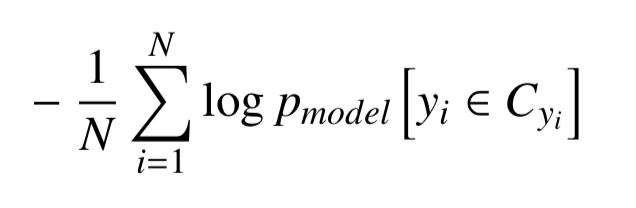
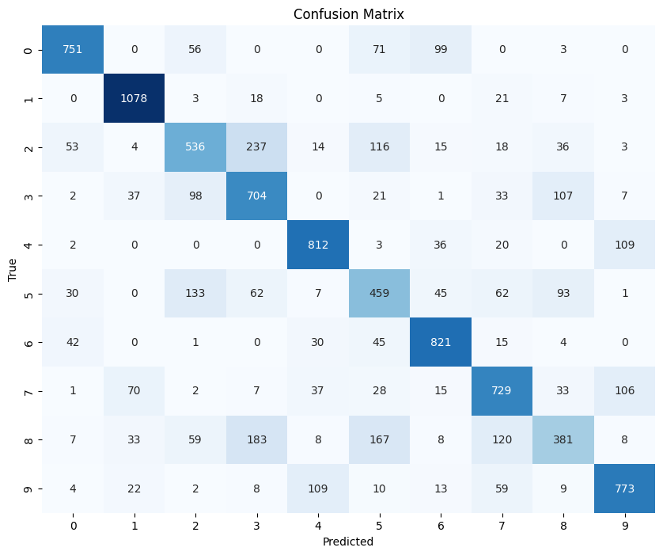
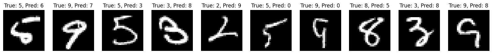
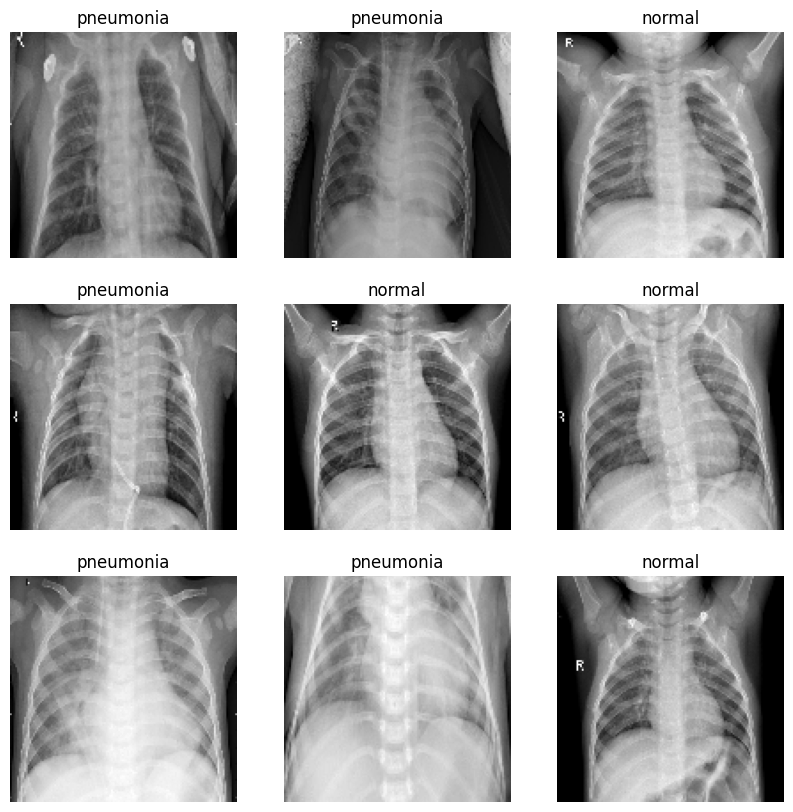

# ARN: Paractical work 4


**Date :** 06/05/2024

**Authors :** Jarod Streckeisen, Timothée Van Hove

## What is the learning algorithm being used to optimize the weights of the neural networks? 

The algorithm used to optimize the weight is RMSprop (Root Mean Square Propagation).


## What are the parameters (arguments) being used by that algorithm? 

From the Keras documentation

**learning_rate**: A float, a keras.optimizers.schedules.LearningRateSchedule instance, or a callable that takes no arguments and returns the actual value to use. The learning rate. Defaults to 0.001.

**rho**: float, defaults to 0.9. Discounting factor for the old gradients.

**momentum** : float, defaults to 0.0. If not 0.0., the optimizer tracks the momentum value, with a decay rate equals to 1 - momentum.

**epsilon**: A small constant for numerical stability. Defaults to 1e-7.

**centered**: Boolean. If True, gradients are normalized by the estimated variance of the gradient; if False, by the uncentered second moment. Setting this to True may help with training, but is slightly more expensive in terms of computation and memory. Defaults to False.

**name**: String. The name to use for momentum accumulator weights created by the optimizer.

**weight_decay**: Float. If set, weight decay is applied.

**clipnorm**: Float. If set, the gradient of each weight is individually clipped so that its norm is no higher than this value.

**clipvalue**: Float. If set, the gradient of each weight is clipped to be no higher than this value.

**global_clipnorm**: Float. If set, the gradient of all weights is clipped so that their global norm is no higher than this value.

**use_ema**: Boolean, defaults to False. If True, exponential moving average (EMA) is applied. EMA consists of computing an exponential moving average of the weights of the model (as the weight values change after each training batch), and periodically overwriting the weights with their moving average.

**ema_momentum**: Float, defaults to 0.99. Only used if use_ema=True. This is the momentum to use when computing the EMA of the model's weights: new_average = ema_momentum * old_average + (1 - ema_momentum) * current_variable_value.

**ema_overwrite_frequency**: Int or None, defaults to None. Only used if use_ema=True. Every ema_overwrite_frequency steps of iterations, we overwrite the model variable by its moving average. If None, the optimizer does not overwrite model variables in the middle of training, and you need to explicitly overwrite the variables at the end of training by calling optimizer.finalize_variable_values() (which updates the model variables in-place). When using the built-in fit() training loop, this happens automatically after the last epoch, and you don't need to do anything.

**loss_scale_factor**: Float or None. If a float, the scale factor will be multiplied the loss before computing gradients, and the inverse of the scale factor will be multiplied by the gradients before updating variables. Useful for preventing underflow during mixed precision training. Alternately, keras.optimizers.LossScaleOptimizer will automatically set a loss scale factor.

**gradient_accumulation_steps**: Int or None. If an int, model & optimizer variables will not be updated at every step; instead they will be updated every gradient_accumulation_steps steps, using the average value of the gradients since the last update. This is known as "gradient accumulation". This can be useful when your batch size is very small, in order to reduce gradient noise at each update step.

## What loss function is being used ? Please, give the equation(s)

categorical_crossentropy




## Experiment 1: Digit recognition from raw data

### Enhanced model

- Activation function sigmoid -> ReLu
- Number of epoch 3 -> 20
- Optimizer RMSProp -> ADAm

### Number of neurons & layers

Adding two layers of 6 neurons was the best compromise we found.

```python
model.add(Dense(6,input_shape=(784,), activation='relu'))
model.add(Dense(6,input_shape=(784,), activation='relu'))
```
More neurons didn't improve accuracy, same for more layers. Two layers was a bit better than a single one.

### Final model 

#### Model Summary


#### Training history


#### Confusion matrix



Test score: 0.9499756097793579
Test accuracy: 0.7037000060081482

#### Mismatch sample


#### Weights

Number of weights : 1700 

Input : 1570

First layer : 6 * 2 + 6 bias \
Second layer : 6 * 6 + 6 bias \
Output : 6 * 10 + 10 bias

Total bias : 22 bias

## Experiment 2: Digit recognition from features of the input data

### Enhanced model pix_p_cell = 4

- Add hidden layer of 8 neurons
- RMSProp -> ADAM
- 3 epoch -> 80 epoch
- pix_p_cell = 4
- n_orientations = 8

#### Model Summary


#### Training history


#### Confusion matrix


Test score: 0.563103437423706 \
Test accuracy: 0.8149999976158142

### Enhanced model pix_p_cell = 7

- Add hidden layer of 8 neurons
- RMSProp -> ADAM
- 3 epoch -> 80 epoch
- pix_p_cell = 7
- n_orientations = 8

#### Model Summary


#### Training history


#### Confusion matrix


Test score: 0.774817705154419 \
Test accuracy: 0.7207000255584717


### Enhanced model pix_p_cell = 2

- Add hidden layer of 8 neurons
- RMSProp -> ADAM
- 3 epoch -> 80 epoch
- pix_p_cell = 2
- n_orientations = 8

#### Model Summary


#### Training history


#### Confusion matrix


  
Test score: 0.5716031789779663 \
Test accuracy: 0.8219000101089478


### Changing n_orientations

Too much n_orientations (i.e 32) reduce model accuracy


### Final model

The best model is the one with 2 pix_p_cell.

- Add hidden layer of 8 neurons
- RMSProp -> ADAM
- 3 epoch -> 80 epoch
- pix_p_cell = 2
- n_orientations = 8

#### Model Summary


#### Training history


#### Confusion matrix


  
Test score: 0.5716031789779663 \
Test accuracy: 0.8219000101089478

#### Mismatch sample




### Analysis

Lower pix_p_cell lead to more resolution and thus better accuracy of the model. It is important to have a high number of orientation if we have a high pix_p_cell to better differenciate HOGs. 

HOG are generated very slowly when n_orientation and pix_p_cell are small. 

When n_orientations = 1 and pix_p_cell = 2, it takes approximately 20 minutes to generate train and test data.


## Experiment 3: CNN

The goal of this experiment is to train a convolutional neural network using the `MNIST` dataset, which contains images of handwritten digits from 0 to 9. We are going to try to identify a good neural network configuration that automatically extracts and learns the optimal features necessary for accurate digit recognition. We will modify and evaluate various configurations, comparing their performance to improve upon the initial model provided in the coursework. The best performing model will then be analyzed.

### Modifying training duration: increasing epochs

One of the first observations from the given training results is the low number of training epochs. Originally set to 3, this low count result in undertraining. To fix this, we increased the number of epochs to 16. This gives the model more iterations over the training data, giving it a chance to learn and refine its weights and bias.

#### Impact on Performance:

- **Initial Model Accuracy**: 46%
- **Improved Model Accuracy**: 59%

The graph below shows a more stable convergence and a reduction in loss, that indicates an better learning process.


### Increasing the number of neurons in the fully connected (dense) layer

An good way to increase the model capacity to learn complex patterns is to increase the number of neurons in the fully connected layers. Initially, our model used only 2 neurons in the fully connected layer, which was a limiting factor for the classification.

Changes made to the dense layer of our CNN model:

````python
l0 = Input(shape=(height, width, 1), name='l0')

l1 = Conv2D(2, (2, 2), padding='same', activation='relu', name='l1')(l0)
l1_mp = MaxPooling2D(pool_size=(2, 2), name='l1_mp')(l1)

l2 = Conv2D(2, (2, 2), padding='same', activation='relu', name='l2')(l1_mp)
l2_mp = MaxPooling2D(pool_size=(2, 2), name='l2_mp')(l2)

l3 = Conv2D(2, (2, 2), padding='same', activation='relu', name='l3')(l2_mp)
l3_mp = MaxPooling2D(pool_size=(2, 2), name='l3_mp')(l3)

flat = Flatten(name='flat')(l3_mp)

l4 = Dense(200, activation='relu', name='l4')(flat)
l5 = Dense(n_classes, activation='softmax', name='l5')(l4)

model = Model(inputs=l0, outputs=l5)
model.summary()
````

Model summary:

| Layer (type)         | Output Shape      | Param # |
| -------------------- | ----------------- | ------- |
| l0 (InputLayer)      | (None, 28, 28, 1) | 0       |
| l1 (Conv2D)          | (None, 28, 28, 2) | 10      |
| l1_mp (MaxPooling2D) | (None, 14, 14, 2) | 0       |
| l2 (Conv2D)          | (None, 14, 14, 2) | 18      |
| l2_mp (MaxPooling2D) | (None, 7, 7, 2)   | 0       |
| l3 (Conv2D)          | (None, 7, 7, 2)   | 18      |
| l3_mp (MaxPooling2D) | (None, 3, 3, 2)   | 0       |
| flat (Flatten)       | (None, 18)        | 0       |
| l4 (Dense)           | (None, 200)       | 3800    |
| l5 (Dense)           | (None, 10)        | 2010    |

Results:

````
Test score: 0.1655777096748352
Test accuracy: 0.927000284194946
````


The following graph shows a stable convergence that indicate an effective learning process:


### Simplifying the network by removing the third convolutional layer

In our previous model configuration, we observed that the output of the third convolutional layer resulted in a very small dimension (3x3 pixels). This small dimension can restrict the network from learning and keeping hierarchies in the image data, which can lead to problems during classification.

We decided to remove the third convolutional layer, because we though that fewer layers with more significant dimensions could enhance learning and generalization :

````python
l0 = Input(shape=(height, width, 1), name='l0')

l1 = Conv2D(2, (2, 2), padding='same', activation='relu', name='l1')(l0)
l1_mp = MaxPooling2D(pool_size=(2, 2), name='l1_mp')(l1)

l2 = Conv2D(2, (2, 2), padding='same', activation='relu', name='l2')(l1_mp)
l2_mp = MaxPooling2D(pool_size=(2, 2), name='l2_mp')(l2)

flat = Flatten(name='flat')(l2_mp)

l4 = Dense(200, activation='relu', name='l4')(flat)
l5 = Dense(n_classes, activation='softmax', name='l5')(l4)

model = Model(inputs=l0, outputs=l5)
model.summary()
````

Model summary:

| Layer (type)         | Output Shape      | Param # |
| -------------------- | ----------------- | ------- |
| l0 (InputLayer)      | (None, 28, 28, 1) | 0       |
| l1 (Conv2D)          | (None, 28, 28, 2) | 10      |
| l1_mp (MaxPooling2D) | (None, 14, 14, 2) | 0       |
| l2 (Conv2D)          | (None, 14, 14, 2) | 18      |
| l2_mp (MaxPooling2D) | (None, 7, 7, 2)   | 0       |
| flat (Flatten)       | (None, 98)        | 0       |
| l4 (Dense)           | (None, 200)       | 19800   |
| l5 (Dense)           | (None, 10)        | 2010    |

Results:

````
Test score: 0.08288714289665222
Test accuracy: 0.9740999937057495
````

#### Impact on Performance

This change reduced the complexity of the model but also its ability to generalize as showed by the higher test accuracy. However, the training and validation loss curves indicate potential overfitting. 

The graph below shows the training and validation loss over the epochs. The validation loss stabilize around 0.1 while the training loss continues to decline. This suggest that while the model fits the training data, its performance on new, unseen data might not improve further without adjustments to prevent overfitting.


###  Increasing convolution layers and adjusting kernel size

To enhance our model's capability to capture more features from the `MNIST` dataset, we decided to increase the number of filters in the convolution layers and adjust the kernel size. The first convolution layer's filter count was increased to 8, and the second to 16, both using larger 3x3 kernels instead of the previous 2x2.

````python
l0 = Input(shape=(height, width, 1), name='l0')

l1 = Conv2D(8, (3, 3), padding='same', activation='relu', name='l1')(l0)
l1_mp = MaxPooling2D(pool_size=(2, 2), name='l1_mp')(l1)

l2 = Conv2D(16, (3, 3), padding='same', activation='relu', name='l2')(l1_mp)
l2_mp = MaxPooling2D(pool_size=(2, 2), name='l2_mp')(l2)

flat = Flatten(name='flat')(l2)

l4 = Dense(200, activation='relu', name='l4')(flat)
l5 = Dense(n_classes, activation='softmax', name='l5')(l4)

model = Model(inputs=l0, outputs=l5)
model.summary()
````

Model summary:

| Layer (type)         | Output Shape       | Param # |
| -------------------- | ------------------ | ------- |
| l0 (InputLayer)      | (None, 28, 28, 1)  | 0       |
| l1 (Conv2D)          | (None, 28, 28, 8)  | 80      |
| l1_mp (MaxPooling2D) | (None, 14, 14, 8)  | 0       |
| l2 (Conv2D)          | (None, 14, 14, 16) | 1168    |
| flat (Flatten)       | (None, 3136)       | 0       |
| l4 (Dense)           | (None, 200)        | 627400  |
| l5 (Dense)           | (None, 10)         | 2010    |

Results:

````
Test score: 0.05078455060720444
Test accuracy: 0.9868999719619751
````

#### Impact on Performance

Moving from a 2x2 to a 3x3 kernel allows the model to get broader feature representations at each layer, improving its capacity to recognize patterns in the image data. On the other hand, by increasing the number of filters, the network can extract a more diverse set of features from the input images, so it can better differentiate the different digits.

#### Observations on Overfitting:

The training loss continues to decrease nearly to zero, while the validation loss shows signs of increase. This suggests that while the model has learned the training data exceptionally well, it may not generalize as effectively on new, unseen data.


### Reducing overfitting with dropout regularization

To mitigate overfitting, we used dropout regularization in our model. This technique is designed to prevent overfitting by randomly "dropping out" a subset of features during the training phase.

Drop-out was applied after each convolutional and dense layer before the final classification layer:

```python
l0 = Input(shape=(height, width, 1), name='l0')

l1 = Conv2D(8, (3, 3), padding='same', activation='relu', name='l1')(l0)
l1_mp = MaxPooling2D(pool_size=(2, 2), name='l1_mp')(l1)
l1_drop = Dropout(0.2, name='l1_drop')(l1_mp)

l2 = Conv2D(16, (3, 3), padding='same', activation='relu', name='l2')(l1_drop)
l2_mp = MaxPooling2D(pool_size=(2, 2), name='l2_mp')(l2)
l2_drop = Dropout(0.2, name='l2_drop')(l2_mp)

flat = Flatten(name='flat')(l2_drop)

l4 = Dense(200, activation='relu', name='l4')(flat)
l4_drop = Dropout(0.5, name='l4_drop')(l4)
l5 = Dense(n_classes, activation='softmax', name='l5')(l4_drop)

model = Model(inputs=l0, outputs=l5)
model.summary()
```

Model summary:

| Layer (type)         | Output Shape       | Param # |
| -------------------- | ------------------ | ------- |
| l0 (InputLayer)      | (None, 28, 28, 1)  | 0       |
| l1 (Conv2D)          | (None, 28, 28, 8)  | 80      |
| l1_mp (MaxPooling2D) | (None, 14, 14, 8)  | 0       |
| l1_drop (Dropout)    | (None, 14, 14, 8)  | 0       |
| l2 (Conv2D)          | (None, 14, 14, 16) | 1168    |
| l2_mp (MaxPooling2D) | (None, 7, 7, 16)   | 0       |
| l2_drop (Dropout)    | (None, 7, 7, 16)   | 0       |
| flat (Flatten)       | (None, 784)        | 0       |
| l4 (Dense)           | (None, 200)        | 157000  |
| l4_drop (Dropout)    | (None, 200)        | 0       |
| l5 (Dense)           | (None, 10)         | 2010    |

Results:

````
Test score: 0.025351719930768013
Test accuracy: 0.9915000200271606
````


#### Impact on Performance

The use of dropout after pooling layers and before the final classification layer makes that the model relies lessr on any particular set of neurons. By randomly disabling neurons during training, this forces the network to get more robust features that do not rely on the presence of particular neurons. 

In the following graph, the training curve shows a smooth decline, while the testing curve remains low and stable, converging to the training loss, which signifies an effective learning and generalization across unseen data.


### Model analysis after enhancement

- **Input Layer : ** l0 receives images of size 28x28 with 1 channel (grayscale images). This is the entry point for data but does not perform any computation.

- **Convolutional Layers : ** l1 applies 8 filters of size 3x3 with the ReLU activation function. The output is 28x28x8 (because `same` padding keeps the output height and width equal to the input).
- l2 applies 16 filters of size 3x3 with the ReLU activation function. This layer's output is 14x14x16, also using `same` padding.

- **Pooling Layers : ** l1_mp and l2_mp perform max pooling with a 2x2 window, reducing the dimensions by half, thus l1_mp results in 14x14x8, and l2_mp results in 7x7x16.
- **Dropout Layers : ** l1_drop**, **l2_drop**, and **l4_drop are used to prevent overfitting by randomly setting a fraction of input units to 0 at each update during training time. Dropout rates are 0.2 after both pooling layers and 0.5 before the final output layer.

- **Dense Layers : ** l4 is a fully connected layer with 200 neurons and ReLU activation function. l5 is the final output layer with 10 neurons (one for each digit) using softmax activation function for multi-class classification.

### 2. Model weights

**Convolutional Layer Weights :**

- l1: (3×3×1)×8+8=80(3×3×1)×8+8=**80** parameters
- l2: (3×3×8)×16+16=1168(3×3×8)×16+16=**1168** parameters

**Dense Layer Weights :**

- l4: 784×200+200=157000784×200+200=**157'000** parameters
- l5: 200×10+10=2010200×10+10=**2010** parameters

**Total Number of Parameters:**
$$
80 + 1168 + 157000 + 2010 = 160’258
$$


### 3. Performance discussion

The tuning process showed a good improvement in model accuracy and a decrease in loss, as evidenced by the loss and accuracy curves provided below. The model achieved a final training accuracy of approximately 98.44% and a validation accuracy of 99.10%, proving its effectiveness in recognizing and classifying the digits from the MNIST dataset.


The graph shows a convergence where the validation loss decreases, suggesting that the model is not underfitting or overfitting. The training loss continues to decline slightly, indicating that the model could potentially improve with more epoch, however, the test loss seem to stagnate.

After finishing the training, the model was evaluated on a separate test set:

- **Test Accuracy:** 99.09%
- **Test Loss:** 0.0254

Those numbers show that the model learned the training data effectively and generalized well to new, unseen data. The high test accuracy aligns with the validation accuracy, indicating the good model robustness and capability to perform a reliable classification.

Along the experiment, we put attention to balance learning efficacy and computational efficiency. The initial configurations with fewer neurons and layers showed underperformance, likely because the model was less complex and was not able to capture the patterns in the data. The successive tuning, including increasing the number of neurons and introducing dropout layers, helped to achieve better generalization and helped to control overfitting.

#### Misclassified images


#### Confusion Matrix


### TODO: Result comparison with the previous experiments


## Experiment 4: Pneumonia Detection Model Performance

The goal of this experiment is to evaluate the performance of a CNN designed to classify chest X-ray images into two categories: normal and pneumonia. The dataset that we used contains 5216 images for training, 16 images for validation and 624 images for testing.




### Model Architecture

The CNN model consists of 5 convolutional layers, each one followed by max pooling layers, and it follows by 2 fully connected (dense) layers. The convolutional layers are designed to extract spatial hierarchies of features from the images, while the dense layers classify these features into the two categories.


### Training Process

The model was trained over 5 epochs with Adam optimizer, Binary Crossentropy loss function and class weight are applied  due to imbalance in the dataset, with more weight given to the minority class.

````
Epoch 1/5
82/82 ━━━━━━━━━━━━━━━━━━━━ 5s accuracy: 0.6850 - loss: 1.6306 - val_accuracy: 0.9375 - val_loss: 0.2436
Epoch 2/5
82/82 ━━━━━━━━━━━━━━━━━━━━ 4s accuracy: 0.9293 - loss: 0.1700 - val_accuracy: 1.0000 - val_loss: 0.1168
Epoch 3/5
82/82 ━━━━━━━━━━━━━━━━━━━━ 4s accuracy: 0.9648 - loss: 0.0862 - val_accuracy: 1.0000 - val_loss: 0.0986
Epoch 4/5
82/82 ━━━━━━━━━━━━━━━━━━━━ 4s accuracy: 0.9687 - loss: 0.0789 - val_accuracy: 1.0000 - val_loss: 0.0668
Epoch 5/5
82/82 ━━━━━━━━━━━━━━━━━━━━ 4s accuracy: 0.9802 - loss: 0.0520 - val_accuracy: 0.8750 - val_loss: 0.1636
````


### Validation Results

- Accuracy: 62.5%
- F1 Score: 66.7%

As we can see in the training output above, the model achieved full accuracy in predicting the validation set in earlier epochs, which dropped in later epochs. This variation might be due to overfitting, given the small size of the validation set.


### Test Results

- Accuracy: 57.2%
- F1 Score: 70.6%

The accuracy on the test set was lower compared to the validation set, which could indicate that the model ability to generalize needs improvement. The higher F1 score compared to accuracy could indicate that the model is better at managing the balance between precision and recall.


### Some misclassified images


### Discussion

The good performance on the validation set in the first epochs, followed by a perfect score, shows problems in the model ability to generalize, because we don't see the same level of performance on the test set. This difference is probably due to overfitting, caused by the small size of the validation set.

The test results show that while the model has learned to classify, its accuracy is still poor. We could have better results by further tuning the model, specifically with data augmentation to improve its ability to generalize to new, unseen data.

A bigger validation set would provide a more solid basis for tuning and evaluating the model. Implementing more complex augmentation techniques could help the model generalize better from the training data. We could also use dropout regularization to reduce the overfitting. Finally, longer training with early stopping would allow the model to stabilize its performance on the training and validation datasets.


## PW4 Questions and conclusion

### Deeper vs. Shallower Models

**Deeper models** (like the current one with multiple convolution and dense layers) generally have more weights due to increased layers and complexity, which allows them to learn more detailed features from the data. However, deeper models also require more computational resources and are more prone to overfitting, which needs strategies like dropout. **Shallower models** might have fewer parameters, making them quicker to train and less prone to overfitting but potentially less capable of learning complex patterns.

#### Example:

TODO

